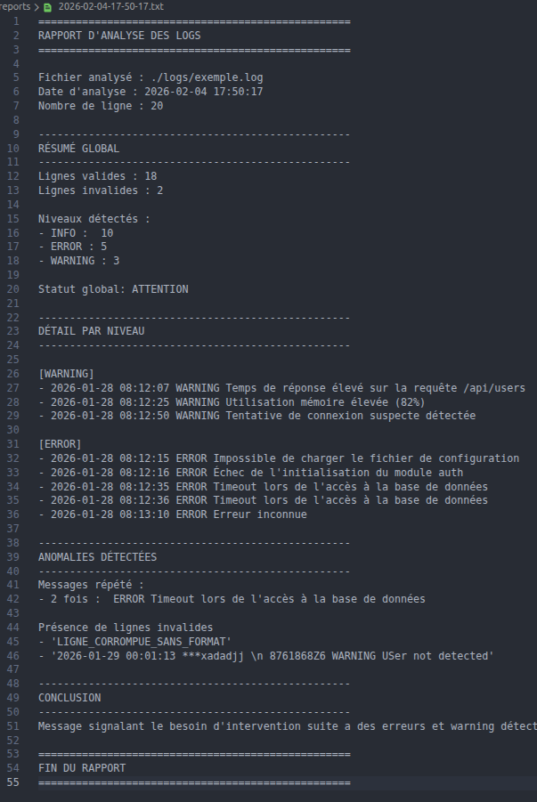

# AnalyzLog
## 📌 Description projet
**AnalyzLog** est un outil en ligne de commande développé en Python permettant d’analyser des fichiers de logs applicatifs (`.log`).  
Il extrait, organise et analyse les événements afin de produire un **rapport de synthèse lisible**, destiné à un usage humain (exploitation, diagnostic).

## 🛠️ Fonctionnalités principales
- Lecture et validation d’un fichier `.log`
- Analyse des niveaux de logs : INFO, WARNING, ERROR
- Détection des lignes invalides ou corrompues
- Analyse de l’état global du service
- Détection des récurrences d’erreurs et warnings
- Génération automatique d’un rapport texte structuré

## 📂 Structure du projet
```css
analyzlog/
main.py
modules/
- arguments.py
- file_loader.py
- log_interpret.py
- analyser.py
- report_generator.py
logs/
- exemple.log
reports/
- YYYY-MM-DD-HH-MM-SS.txt
README.md
```

## ➡️ Utilisation
1. Cloner le projet dans vos documents:
```bash
git clone https://github.com/loski554/AnalyzLog
cd AnalyzLog
```

2. Lancer le projet:
```bash
python3 main.py ./logs/exemple.log #tester avec les differents fichiers présents dans ./logs
```

## 🧠 Points techniques mis en avant
- architecture code modulaire
- séparations des fonctions
- oragnisations de données
- gestions des erreurs avec logging
- création d'un rapport .txt

## 📋 Exemple d'un rapport


Axe d'amélioration possible :
- export en fichier json
- interface graphique
- meilleure compatibilité et flexibilité

## ✍️ Auteur
Projet réalisé par **Lucas Goulain/loski554**
